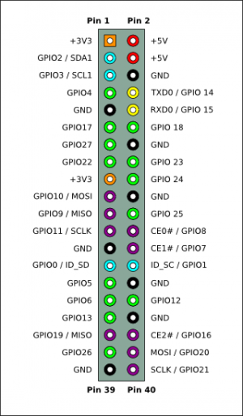

# RPi_Node
Under uppbyggnad!!!!
Syftet med detta proj är att testa RESTful API for Raspberry Pi. Genom att använda NODE.JS och Express.js skapar vi en server.js som sätter och läser RPi's GPIO. Dessa tillgängliggörs sedan genom Express REST API. HTML-filen som ges på localhost:3000 är index.html var uppgift är att göra ett 
# Setup för Raspberry Pi

## Filer
* server.js (Server side NODE)
* index.html (Webbfil)
* client.js (Client side JavaScript)
* style.css (stil)

## GPIO
* Använder pin 11 (gpio 17) som input
* Använder pin 12 (gpio 18) som input


[eLinux.org](http://elinux.org/RPi_Low-level_peripherals)

## Setup
Skapa projektmapp i filsystemet på lämplig plats (exempelvis 'Proj') genom ```mkdir Proj``` och ```cd Proj```
```javascript
get clone https://github.com/johansundstrom/RPi_Node
```
I windows används git-kommandot (https://git-scm.com/)
```dos
git clone https://github.com/johansundstrom/RPi_Node
```
Setup file package.json
```javascript
npm init
```
Install Express, (--save-tillägget uppdaterar dependencies i package.json)
```javascript
npm install express --save
```
Install Connect
```javascript
npm install connect --save
```
Install Pi-GPIO)
```javascript
npm install pi-gpio --save
```

## Starta
```javascript
sudo node server.js
```

## Johan Sundström
