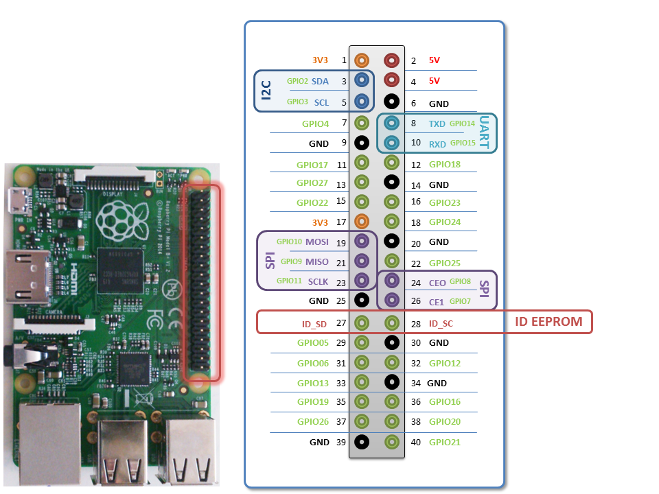

# Raspberry Pi RESTful API med GPIO
Projektet testar RESTful API for Raspberry Pi. Genom att använda NODE.JS och Express.js skapas server.js som initialiserar och läser RPi's GPIO. Dessa tillgängliggörs sedan genom Express REST API. Index.html på localhost:3000 laddar client.js och tar emot värden på http://localhost:3000/index.html/input/pin#

# Setup för Raspberry Pi

## Filer
* server.js (Server side NODE)
* index.html (Webbfil)
* client.js (Client side JavaScript)
* style.css (stil)

## GPIO
* Använder pin 16 (GPIO 23) som input
* Använder pin 22 (GPIO 25) som input


[eLinux.org](http://elinux.org/RPi_Low-level_peripherals)

## Setup
Skapa generell projektyta i filsystemet på lämplig plats (exempelvis '~/Proj') genom ```mkdir Proj``` och ```cd Proj```. På Raspberry Pi i terminalfönstret...
```javascript
git clone https://github.com/johansundstrom/RPi_Node
```
Install Express
```javascript
npm install express
```
Install Pi-GPIO
```javascript
npm install pi-gpio
```

## Starta
```javascript
node server.js
```
## Problem

## Notes to self
mongod --dbpath "C:\Program Files\MongoDB\Data\DB". Onödigt problem med core-uppdatering och ```gpio-admin.c``` löses med [http://stackoverflow.com/questions/36735925/gpio-over-raspberry-pi-3-model-b-using-node-js](http://stackoverflow.com/questions/36735925/gpio-over-raspberry-pi-3-model-b-using-node-js)

## GPIO manipulation
```javascript
pi@raspberrypi ~ $ sudo echo 17 > /sys/class/gpio/export
pi@raspberrypi ~ $ sudo echo out > /sys/class/gpio/gpio17/direction
pi@raspberrypi ~ $ echo 1 > /sys/class/gpio/gpio17/value
pi@raspberrypi ~ $ echo 0 > /sys/class/gpio/gpio17/value
```
